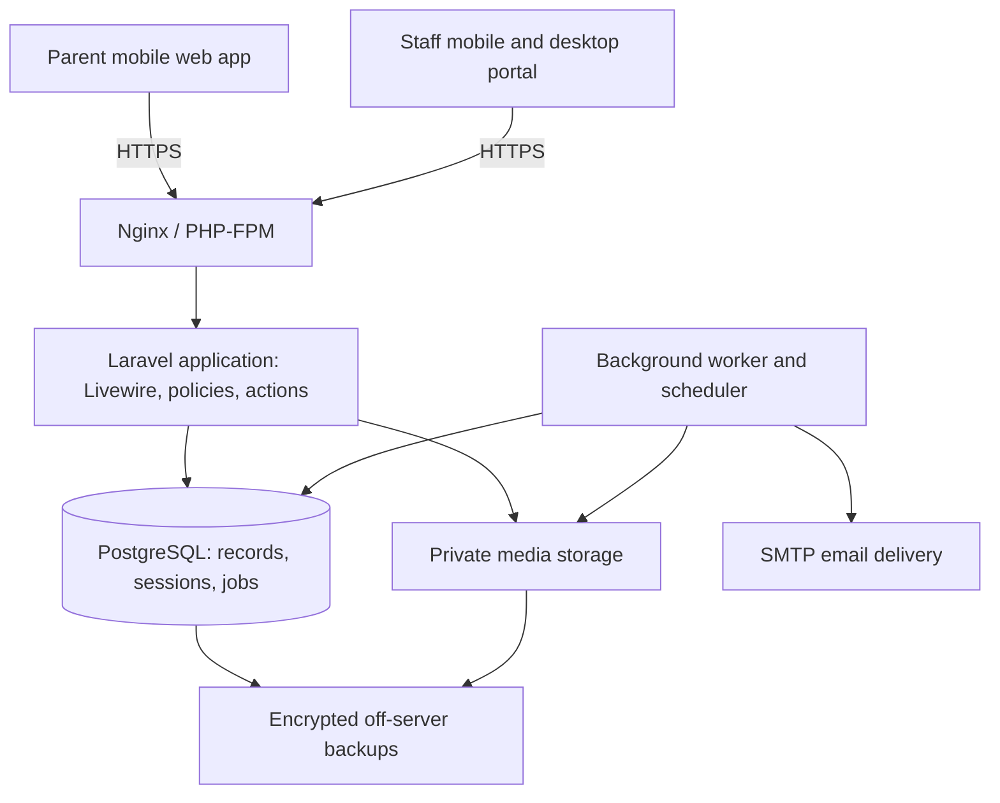

# Sibol — technical design v0.1

Date: 21 September 2026
Status: Proposed implementation baseline; no infrastructure provisioned
Product: Mobile-first childcare platform for Philippine preschools
Delivery target: Four-week pilot, following stories SIB-01 through SIB-22

## 1. Outcome and operating assumptions

Deliver an installable mobile web experience for parents and a responsive staff portal from one codebase. Preserve the Sibol mock-up's Today, Journal, Messages, Fees, and Family navigation. Staff receive class attendance, daily updates, pickup, messages, and administration screens.

Planning envelope, to validate with the pilot school: one school, up to 100 children, approximately 250 guardian accounts, 15 staff, and 30 concurrently active users. These are design and load-test inputs, not measured capacity claims. The earlier timeline assumes two engineers with part-time design/product and QA support.

MVP includes invitations, scoped access, attendance, journal photos and care logs, text messaging, announcements, approved pickup, invoices, and manual payment verification. Live wallet checkout, native app-store releases, video, offline writes, payroll, and multi-school management UI are deferred. Local GCash/Maya payment references are supported; the application does not move money in the pilot.

## 2. Recommended stack

| Layer | Decision | Why |
|---|---|---|
| Application | Laravel 13, compatible supported PHP release (target PHP 8.4; verify all dependencies when scaffolding) | Established authentication, validation, authorization, migrations, queues, and tests in one application |
| UI | Blade + Livewire 4 + Alpine for small local interactions | Server-rendered screens with modest client logic; one language for most application work |
| Styling | Tailwind CSS + custom Blade components + Lucide icons | Reproduce the mock-up without a paid component library |
| Database | PostgreSQL, supported stable major pinned at scaffolding | Relational constraints, transactions, and row locks for attendance and billing |
| Session/cache/queue | Laravel database drivers | Reuse PostgreSQL; no separate cache or message-broker service for the pilot |
| Media | Private local filesystem, accessed through authorized application endpoints | Low initial cost; Laravel storage abstraction allows later private object storage |
| Hosting | One Linux VPS: Nginx, PHP-FPM, PostgreSQL, queue worker, scheduler | Small operational footprint and portable deployment |
| Email | Configurable SMTP provider for invitations and account recovery | Application remains portable; delivery service may have usage fees |
| Tests | PHPUnit/Laravel feature tests + Playwright for key browser flows | Verify business invariants and mobile user journeys |
| Build | Composer + Vite; committed dependency lockfiles | Reproducible builds; Node required for builds, not production request handling |
| PWA | Web manifest, icons, standalone display, static offline fallback | Home-screen installation where supported; authenticated data stays network-only |

Laravel and Livewire use MIT licenses, and PostgreSQL has a permissive open-source license. Use only free/open-source UI dependencies. Inventory their actual licenses in the lockfile review; do not assume paid extensions are included with a free framework. Application source licensing is a separate owner decision.

Laravel 13 requires at least PHP 8.3. The official Livewire starter kit may be used for authentication scaffolding; bespoke Sibol screens use our own components, without requiring Flux Pro.

### Alternatives considered

- Django + HTMX + PostgreSQL: similarly credible and lightweight operationally. Prefer this if the implementing team is significantly stronger in Python.
- React/Next.js + a backend service: useful when the team already has that expertise, but adds frontend state and backend integration work to this deadline.
- Flutter or React Native: suitable for a later native client; adds another delivery surface now.
- SQLite: excellent for smaller single-process tools, but PostgreSQL is the default here because multiple staff actions, billing verification, and queue jobs share concurrent writes.

The chosen design minimizes service count and delivery complexity. Livewire actions usually require a network round trip; local menus and UI toggles use Alpine, while authoritative changes remain on the server.

## 3. Architecture and code boundaries



One repository and deployable application. Organize business logic into Actions, Models, Policies, Jobs, and Notifications rather than separate services. Livewire components validate input, authorize the operation, invoke an action, and render the result. Actions own transactional business rules so a future mobile API can reuse them.

Suggested layout:

```text
app/Actions/{Identity,Attendance,Journal,Messaging,Pickup,Billing}/
app/Livewire/{ParentApp,Staff,Admin}/
app/Models/
app/Policies/
app/Jobs/
app/Notifications/
resources/views/{components,layouts,livewire}/
lang/{en,fil}/
routes/web.php
routes/console.php
tests/{Feature,Unit}/
tests/browser/
```

Named application routes use session authentication on the same origin. Livewire handles component actions; a public REST API is not needed for the first client. Dedicated HTTP endpoints handle protected media and document downloads. No auth tokens in browser local storage.

## 4. Identity, school scope, and permissions

Users are global identities. A school membership grants staff roles or parent membership; child_guardians grants explicit access to a particular child. A user may have more than one role. Pickup contacts are separate records and do not implicitly become users.

| Capability | Administrator | Teacher | Guardian | Pickup-only contact |
|---|---|---|---|---|
| School roster/invitations | Own school | Assigned class roster only | Own linked child profile | No login |
| Attendance | Own school | Assigned children | Read linked child | None |
| Journal | Manage own school | Create for assigned children | Read linked child | None |
| Messages | School threads | Assigned child threads | Explicit child-thread access | None |
| Pickup contacts | Approve/revoke | View for assigned children | Request for linked child if permitted | None |
| Record handoff | Yes | Assigned children | No | No |
| Invoices/payment proof | Manage own school | No | Explicit billing access | None |

Guardian access includes independent flags for viewing updates, messaging, arranging pickup, and billing. Linking someone as a guardian never automatically grants billing access. Default privileges are set explicitly during invitation. MVP messaging is one shared school/guardian thread per child, clearly labeled so participants understand other approved guardians can read it; separate confidential threads are deferred.

Every school-owned table has school_id. Every request resolves an active membership on the server. Child queries are scoped to that school, then checked against the operation's policy and guardian/class relationship. Client-supplied identifiers are never treated as proof of access. Repeat authorization on every Livewire action and media download.

School scoping in application policies is the initial boundary; PostgreSQL row-level security is not assumed. Composite school-and-record foreign keys should prevent cross-school relationships at the database layer where practical. Test direct identifier substitution against every sensitive operation. Public opaque IDs are convenient but not a security boundary.

Invitations use random single-use tokens stored as hashes, a proposed 48-hour expiry, intended email and school, and explicit role/child permissions. Reissuing revokes the old token. Disable public self-registration. Membership revocation applies immediately through request-time checks; it must also prevent media access and queued notification delivery. Account-level revocation invalidates sessions.

## 5. Data model

Use bigint internal IDs and non-sequential public identifiers for exposed records. Use foreign keys, server timestamps, UTC timestamptz values, and Asia/Manila display/business dates. Money is integer centavos with currency PHP; never floating-point arithmetic.

| Tables | Main fields and relationships |
|---|---|
| schools | name, timezone, status |
| users | name, verified email, password hash, locale |
| school_memberships / membership_roles | school_id, user_id, active status, explicit roles; unique membership per school/user |
| invitations / invitation_child_permissions | school, email, role grants, token hash, expiry, acceptance, explicit child grants |
| classrooms / classroom_staff | school, classroom, teacher membership |
| children / enrollments | child identity, school, class, start/end dates; one active class per child for the pilot |
| child_guardians | child, guardian membership, relationship, access flags, revocation time |
| attendance_sessions | child, check-in/out times and staff, business date; at most one open session per child |
| attendance_events | session, event type, actor, effective time, recorded time, correction reason; append-only application history |
| journal_entries / journal_recipients | author, category, body, occurred_at, processing/published/removed state; explicit child audience |
| media_assets / journal_media | school, uploader, private path, MIME, size, processing state, association |
| reactions | entry, guardian, kind; unique entry/user reaction |
| child_threads / messages / thread_reads | one thread per child, sender, body, created_at, last-read message per membership |
| announcements / announcement_recipients | author, title, body, urgent, publication state, explicit child audience captured at publish |
| notifications | recipient membership, record reference, read_at; content fetched only after current authorization |
| pickup_contacts / child_pickup_authorizations | contact name/relationship; per-child pending/approved/rejected/revoked status, approving staff, timestamps |
| pickup_arrangements | child, school-local date, approved authorization, planned time, version; unique child/date |
| pickup_handoffs | attendance session, collector identity snapshot, verification method, verified_by, occurred_at |
| invoices / invoice_items | child, school-scoped unique number, draft/issued/void state, due date, item descriptions and integer amounts |
| payment_submissions | invoice, submitted amount, method, reference, proof asset, pending/approved/rejected state, reviewer and reason |
| payments | invoice, approved submission, amount, verified_by, verified_at; unique submission and one full settlement per MVP invoice |
| audit_events | school, actor, action, subject reference, safe changed fields, reason, timestamp |

Attendance sessions provide the current view; append-only events preserve corrections. Invoice payment status is derived from approved payment records; overdue is derived from due date and unpaid balance. Avoid multiple independently mutable copies of the same financial truth.

Add indexes for school/class roster queries, journal recipient + entry, child/time attendance, thread/id messages, recipient/unread notifications, and school/status/due-date invoices. Journal and chat use cursor pagination, initially 20 entries. Review actual query plans against seeded pilot-sized data.

For class-wide posts, snapshot the child audience at publication. This prevents a newly enrolled child automatically receiving the entire historical class feed. A guardian must still have current permission for a recipient child to read the post. Revoked accounts lose access even when they were original recipients. Group-photo publication follows the school's recorded media-sharing choices; staff must select an appropriate audience.

## 6. Critical workflows

### Check-in and pickup

1. Check-in verifies staff assignment and locks the child attendance state in a database transaction.
2. A partial unique index on open sessions prevents concurrent duplicate check-ins.
3. An approved pickup authorization is required to save an arrangement. Saving and revoking authorizations use consistent locking so concurrent edits cannot silently restore revoked access.
4. At actual pickup, re-read and lock the current authorization and attendance session. Verify identity in person; the planned pickup name is not identity verification.
5. Persist the handoff and checkout atomically. A repeated request with the same operation key returns the original outcome.
6. A revoked collector is blocked even if selected earlier. Staff resolves changes through a newly approved authorization; no silent bypass.
7. Corrections append an event and require a reason. MVP has one planned collector per day and supports multiple attendance sessions, with only one open at a time.

### Journal photos

Accept one JPEG/PNG/WebP image per entry initially, with a proposed 8 MB upload limit and pixel-dimension limits. Validate actual decoded content, not just the filename. Reject SVG and unsupported formats with a clear message. Verify the phone photo-selection workflow during the first device test; HEIC conversion is a compatibility decision to resolve before the pilot, not assumed support.

Store uploads privately under generated paths. A background job decodes, resizes to a maximum proposed 1600-pixel long edge, produces a thumbnail, strips metadata, and re-encodes the image. Aim for roughly 150–400 KB per displayed image, subject to visual quality. Delete temporary originals after successful processing. Publish media entries only when processing succeeds; failed uploads remain visible to the author with a retry option. Clean up abandoned uploads.

The authorized media endpoint checks current record visibility and returns a private, no-store response, using an internal Nginx file handoff if needed. Never expose the private storage directory through a public symlink. Removing a post immediately blocks its media endpoint, with eventual physical deletion governed by retention policy.

### Messages and updates

Store a text message immediately; create the corresponding in-app notification in the same transaction. Use a client-generated operation key and server uniqueness to make retries safe. Poll the active conversation around every 15 seconds, requesting only new data; pause polling when hidden/offline. Other screens refresh on navigation or explicit refresh. No WebSocket server for the pilot. Livewire supports configurable polling; explicit hidden/offline pause behavior must be implemented and tested.

The user sees pending/sent/failed message state and can retry. Do not show a false read receipt: update read position only while the thread is visible. MVP provides in-app notifications, not background push or SMS. Weather notices are authored by the school and do not claim to be an automated government alert feed.

### Invoices and payment verification

1. Staff creates a draft. Server sums validated integer line amounts; issue assigns a school-scoped invoice number in a transaction.
2. Issued amounts cannot be edited. An unpaid invoice can be voided and replaced with a linked replacement. Pending submissions must be resolved before voiding; paid-invoice corrections/refunds require a separately designed follow-up workflow.
3. Parent sees school-supplied payment instructions and pays outside Sibol using the school's existing channel.
4. Parent submits method, reference, and optional image proof. MVP permits one pending submission per invoice and exact full payment only. Parent-facing status says pending verification, not paid.
5. Administrator verifies against the school's actual payment record. In one transaction, lock invoice and submission, confirm issued/unpaid status and exact amount, create payment, mark submission approved, and record audit/notification events.
6. Unique constraints and idempotency prevent two staff approvals or retries from crediting twice. Rejected submissions carry a reason; a new submission can follow rejection.
7. References can be flagged for reuse within a school/method but are not treated as definitive external settlement evidence.

Internal payment acknowledgments are not advertised as a replacement for the school's official financial documents. No card credentials or wallet PINs are collected. Future provider integration belongs behind a dedicated payment service and requires verified, idempotent webhook processing before any automatic settlement state changes.

## 7. Mobile, PWA, and localization

Use responsive layouts starting at 360px, and validate 320px. Parent navigation follows the mock-up; staff attendance/pickup screens support one-handed use with large targets. Use semantic forms, labeled controls, keyboard access, sufficient contrast, and explicit pending/error states. Avoid whole-page rerenders for minor controls.

PWA installation adds a home-screen entry where the browser supports it. Cache only versioned public assets and a generic offline page. Never service-worker-cache child records, HTML containing private data, chats, invoices, or photos. Do not persist sensitive component snapshots across logout. All authoritative writes require a connection; failed actions are explicit and retryable, with no offline success indication.

Put interface strings in English/Filipino translation files from Sprint 1; complete translated copy in Sprint 4. School-written text is not automatically translated. Store timestamps in UTC and compute school dates using Asia/Manila. Format PHP currency from integer centavos. Store date-only values such as birthdays as dates, not timestamps.

Proposed validation targets, not guarantees: first usable parent screen within 3 seconds on a defined mid-range Android/4G test profile; p95 ordinary server requests below 500 ms excluding uploads/external email; validate a 30-active-user mix of attendance, messages, and feeds. Establish baseline measurements in Sprint 1.

## 8. Security and record handling built into delivery

Use framework password hashing, HTTPS, secure/HttpOnly/SameSite session cookies, CSRF protection, rate limits, server validation, and escaped user content. Require admin/teacher MFA before real child data is onboarded; include this in Sprint 1 foundation estimates. Sensitive permission changes require recent authentication. Avoid rendering rich HTML from school-authored messages in the pilot.

Logs contain technical identifiers and error codes, not chat bodies, passwords, invitation tokens, child photos, or payment proofs. Audit critical permission, attendance, pickup, invoice, and payment changes; audit records are append-only through application permissions, not claimed to be cryptographically tamper-proof. Restrict production database access.

Collect only data used by the pilot. Do not add government-ID photo storage or biometric verification. Agree the school's retention, media-sharing, access, and deletion procedures before onboarding real families. Deletion must account for backups and restore procedures. This document is an engineering design, not a certification of legal compliance.

## 9. Deployment, costs, and recovery

Start with a 2-vCPU / 4-GB RAM VPS in Singapore if the chosen plan is available there. Keep PostgreSQL bound to the private host interface and expose only HTTPS plus restricted administration. Run one low-concurrency queue worker and a scheduler; supervise/restart them automatically. Cap PHP workers and image processing memory to fit the host.

Use build artifacts produced locally/CI; deploy immutable release directories, migrate with backward-compatible changes, switch the release link, and restart queue workers. Keep persistent media and configuration outside release directories. Roll back application releases only when schema-compatible; avoid destructive migration rollbacks during incident recovery.

DigitalOcean lists a regular Basic 2-vCPU / 4-GiB instance at US$24/month as checked on 21 September 2026. Regional plan availability and checkout pricing must be confirmed. This is a transparent planning reference, not a claim that it is the cheapest host.

| Item | Monthly planning allowance |
|---|---:|
| Production VPS | US$24 reference |
| Separate encrypted backup storage | US$5–10 estimate; provider/retention dependent |
| SMTP email | US$0–10 estimate; volume/provider dependent |
| Total production infrastructure | Roughly US$30–50, before tax, domain, and labor |
| Separate staging VPS during build | Optional US$6–12 estimate; use synthetic data only |

There is no required per-user software license in this proposal. Infrastructure, operational labor, email delivery, domain registration, and future payment transaction charges remain separate costs. Staging, higher storage growth, and paid monitoring are not hidden inside the production estimate.

At 100 children × 2 images/day × 22 school days × 0.3 MB/image, processed images add approximately 1.32 GB/month before thumbnails and backups. This is a sizing assumption, not observed usage. Alert on storage growth and choose retention deliberately.

Use encrypted nightly PostgreSQL logical backups and private-media backups to an off-server destination. Back up deployment configuration and application encryption keys securely, separate from the source repository. Reconcile database/media consistency in the restore process; briefly quiesce writes for a consistent pilot snapshot if necessary. Retain an agreed daily/weekly history and restrict backup deletion permissions.

Initial recovery objectives: up to 24 hours of data loss and restoration within 4 hours, subject to a timed restore rehearsal. These are targets requiring school acceptance, not an SLA. If losing a day's attendance/payment records is unacceptable, add more frequent database backup/PITR and media replication before launch, with revised cost/operations estimates.

Monitor application health from outside the VPS, error rates, failed jobs, backup completion, disk/memory pressure, and certificate expiry. A single VPS is a single point of failure and needs an identified patching/support owner. Maintain the school's manual attendance and pickup fallback for outages.

## 10. Implementation order and verification

| Sprint | Stories | Technical outputs |
|---|---|---|
| 1 | SIB-01–05 | Repository, CI, staging, auth/MFA, schema, policies, invitations, roster, attendance transactions, parent shell; translation keys and backup setup begin here |
| 2 | SIB-06–11 | Private media pipeline, journal audience rules, care logs, chat retries/polling, announcements, in-app notifications |
| 3 | SIB-12–16 | Pickup approval/handoff transactions, invoice issuance, manual payment verification, concurrency tests |
| 4 | SIB-17–22 | Filipino copy, mobile/performance fixes, recovery rehearsal, end-to-end pilot acceptance, staff onboarding |

Security and backups are developed from Sprint 1; Sprint 4 validates them. Admin/teacher MFA and explicit recovery work may require re-estimating the earlier 80-point backlog. Cut optional reactions or translation completeness first if capacity slips.

Meaningful automated checks:

- Use PostgreSQL in CI for constraint and locking tests; SQLite cannot establish PostgreSQL concurrency behavior.
- Direct cross-school/cross-child access attempts, including private media, notifications, billing, and Livewire actions.
- Guardian billing restrictions, teacher class restrictions, revoked membership, and removed journal audience access.
- Concurrent check-ins; repeated checkout; pickup authorization revoked immediately before handoff.
- Two staff approving the same payment; competing submissions; retry after a committed write whose response was lost.
- Decimal display/integer calculations, invoice numbering, issued invoice immutability, Manila date boundaries.
- Invalid/oversized uploads, image processing failure/retry, removed media, and metadata removal.
- Parent/staff browser journeys on small screens, failed connection behavior, session expiry, and language switching.
- Backup restoration into a clean environment with representative database and media consistency checks.

First vertical slice: admin invites guardian → guardian sees linked child → teacher checks child in → parent sees attendance → unrelated guardian and revoked guardian are denied. Complete this slice before building all screens independently.

## 11. Remaining product decisions

Defaults above allow technical work to proceed. Confirm pilot school/roster size, who will implement and operate the app, acceptable recurring budget, whether the school's users have reliable email for invitations, and whether the shared guardian thread model fits their expectations. Provider selection, domain purchase, and recovery targets remain decisions before production provisioning. No paid service has been ordered.

## Sources checked

- Laravel 13 requirements: https://github.com/laravel/docs/blob/13.x/releases.md
- Official starter kits: https://github.com/laravel/docs/blob/13.x/starter-kits.md
- Laravel license: https://github.com/laravel/framework/blob/13.x/LICENSE.md
- Livewire license: https://github.com/livewire/livewire/blob/main/LICENSE.md
- PostgreSQL license: https://www.postgresql.org/about/licence/
- Database-backed queues: https://laravel.com/docs/13.x/queues
- Private filesystem support: https://laravel.com/framework/docs/filesystem
- Livewire polling: https://livewire.laravel.com/docs/4.x/wire-poll
- VPS pricing: https://www.digitalocean.com/pricing/droplets
- Regional availability: https://docs.digitalocean.com/platform/regional-availability/
